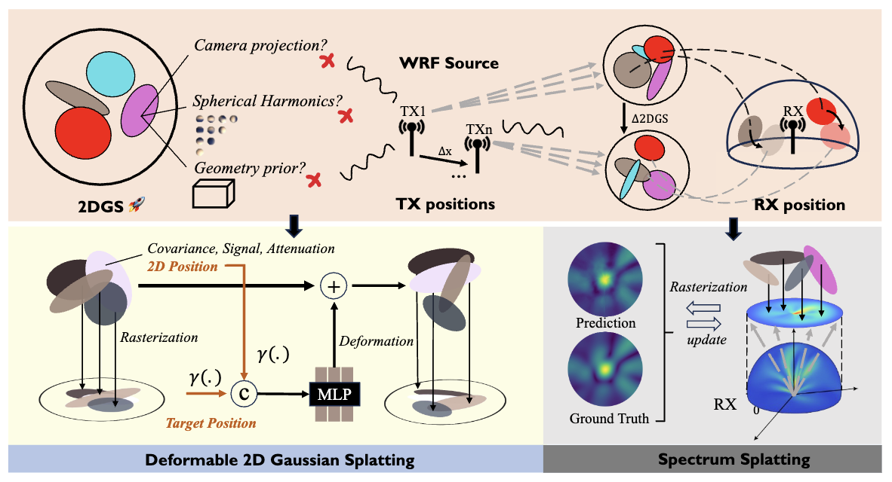
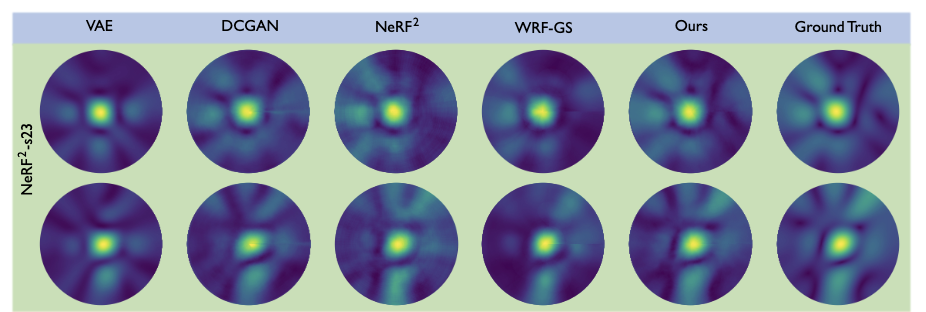

# 🚀**SwiftWRF**

official Pytorch implementation of: rasterizing wireless radiance field via deformable 2D Gaussian splatting.

## A fast yet efficient wireless radiance field modeling method with over **10k FPS!**

[**Paper**](https://arxiv.org/pdf/2506.12787)｜[**Project Page**](https://evan-sudo.github.io/swiftwrf/)｜[**Data**](https://1drv.ms/f/c/b1b302e6d09c4153/EpCJ4-YrQjZGgOMjYdWOFTQBQ9tqdCVqmRm-s7iU0mZkJA?e=iLQE6W)

## ⚡️**Overview**



We propose SwiftWRF, a deformable 2D Gaussian splatting framework that synthesizes WRF spectra at arbitrary positions under
single-sided transceiver mobility. SwiftWRF employs CUDA-accelerated rasterization to render spectra at over 100k FPS and uses the
lightweight MLP to model the deformation of 2D Gaussians, effectively capturing mobility-induced WRF variations. In addition to novel
spectrum synthesis, the efficacy of SwiftWRF is further underscored in its applications in angle-of-arrival (AoA) and received signal
strength indicator (RSSI) prediction.
## ⚡️**Performance**


## ❓**Requirements**

Before running the code, install the required dependencies:

```
cd gsplat
pip install .[dev]
cd ../
pip install -r requirements.txt
```

The `gsplat` module is implemented based on [GaussianImage](https://github.com/Xinjie-Q/GaussianImage). Please ensure it is correctly installed before proceeding.

## 📖**Dataset**
Before running the experiments, you need to download the **NeRF2-s23** and **Our customized** datasets.  

- **NeRF2-s23**: See [NeRF2](https://github.com/XPengZhao/NeRF2?tab=readme-ov-file)
- **Our customized data**: [SwiftWRF](https://1drv.ms/f/c/b1b302e6d09c4153/EpCJ4-YrQjZGgOMjYdWOFTQBQ9tqdCVqmRm-s7iU0mZkJA?e=iLQE6W)


The SwiftWRF dataset comprises three indoor scenes: bedroom, conference, and office; each captured under either a TX-moving or RX-moving setting. Each scene includes approximately 6,000 spectra, and the dataset is organized following the structure of NeRF2.

After downloading, place the dataset inside the `datasets/` directory, e.g., datasets/NeRF2, before proceeding with training or evaluation.

## 🏃**Startup**
To run **SwiftWRF**, execute the following command:

```
./scripts/train.sh <yourpath>/datasets/nerf2
```

To run **SwiftWRF** with loaded models, add the following command to ./scripts/train.sh:

```
--model_path "./checkpoints/"
```
## ❕**TODO**
-Release training code for RSSI prediction.

## 📑**Citation**
If you find our work helpful, please cite as follows:
```
@misc{liu2025rasterizingwirelessradiancefield,
      title={Rasterizing Wireless Radiance Field via Deformable 2D Gaussian Splatting}, 
      author={Mufan Liu and Cixiao Zhang and Qi Yang and Yujie Cao and Yiling Xu and Yin Xu and Shu Sun and Mingzeng Dai and Yunfeng Guan},
      year={2025},
      eprint={2506.12787},
      archivePrefix={arXiv},
      primaryClass={cs.CV},
      url={https://arxiv.org/abs/2506.12787}, 
}
```


## 😯Acknowledgement
Some source code of ours is borrowed from [GaussianImage](https://github.com/Xinjie-Q/GaussianImage) and [D-3DGS](https://github.com/ingra14m/Deformable-3D-Gaussians). We sincerely appreciate the excellent works of these authors.
